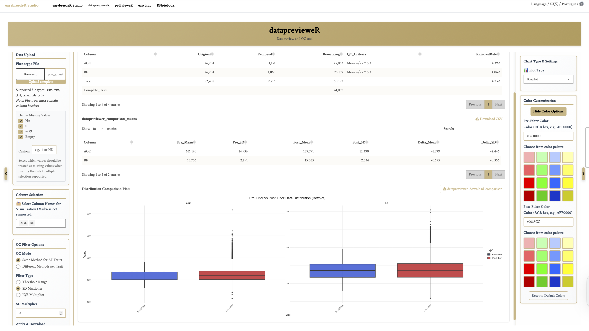
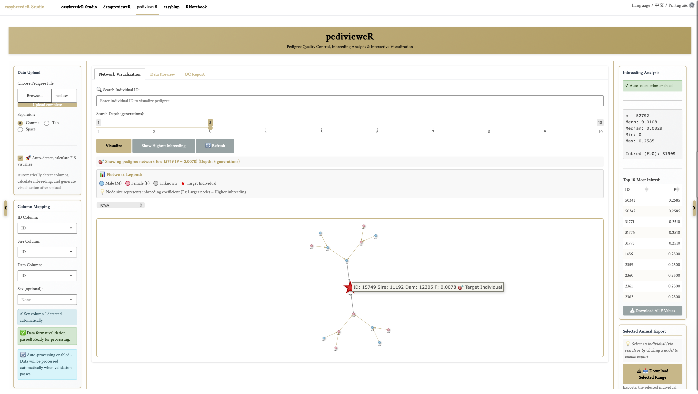
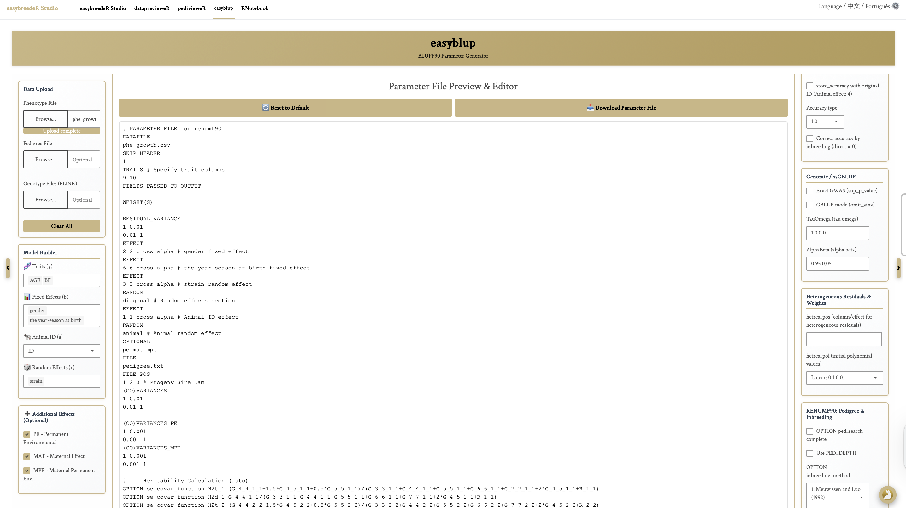
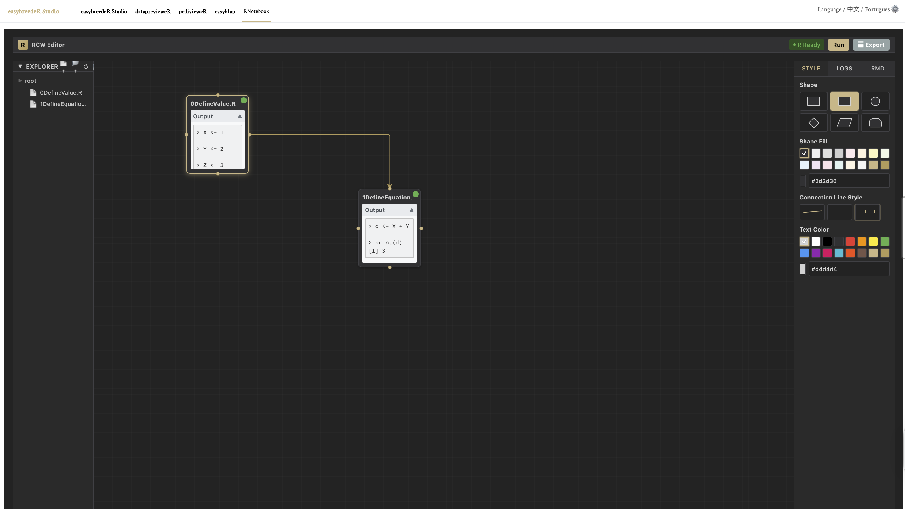

# Summary

Breeding research fundamentally relies on the integration of three primary data sources: phenotypes, pedigree, and genotypes. However, the statistical analysis required to integrate these datasets is often a multi-step and technically complex process, demanding proficiency with diverse command-line tools and extensive data manipulation. This fragmented workflow presents a high technical barrier, especially for new researchers and breeding practitioners without extensive programming expertise. To address this gap, we developed easybreedeR, an interactive and user-friendly R Shiny application designed to streamline the end-to-end workflow of quantitative genetic analysis. The example data used within this software (including phenotypic, pedigree, and genotypic files) is sourced from the supplemental material of Zhang et al. (2022) [@Zhang2022Dataset]. The platform integrates essential modules for phenotypic data visualization and quality control, pedigree checking and visualization, a blupf90[@Misztal2018]. parameter-file generator, and an R workflow management tool. By consolidating these scattered analysis procedures into a single, intuitive interface, easybreedeR significantly lowers the technical barrier for performing comprehensive genetic analyses. This tool aims to make routine breeding evaluation simpler, more reproducible, and widely accessible, enabling breeders, students, and researchers to perform robust analyses efficiently.

# Statement of Need

Quantitative geneticists and animal breeders frequently rely on a combination of custom R scripts, spreadsheet software like Excel, and command-line tools such as the blupf90 family of programs[@Misztal2018]. Although these workflows are powerful and necessary for advanced data analysis, they are often fragmented, error-prone due to manual data handling, and demand considerable programming expertise. The use of existing tools such as blupf90 [@Misztal2018] for the genetic analysis, presents a steep learning curve for students, new researchers, and practitioners who may not have a background in computational work. This fragmentation hinders not only efficiency but also the reproducibility of the analyses.
easybreedeR directly addresses this challenge by providing a unified, user-friendly, point-and-click interface that automates and standardized the entire workflow, from initial data quality control to the final generation of parameter files for genetic evaluation. Crucially, the software preserves reproducibility by generating the underlying R code for all processing steps, allowing for transparent and verifiable analysis. It is designed for both students and professionals who require accessible yet rigorous tools for routine breeding data analysis. By guiding users through each step of the evaluation process, easybreedeR helps newcomers gradually internalize the logic of genetic evaluation and master the prerequisite data preparation for complex analyses. Thus, easybreedeR simplifies routine breeding data analysis and lowers the entry barrier by integrating data checking, pedigree quality control, and blupf90 parameter preparation into a single, cohesive environment, fostering more efficient and reproducible research in animal breeding.

# Key Functions
easybreederR is composed of four main modules, each addressing a critical step in the breeding data analysis workflow.
## Phenotype Preview and Quality Control (`dataprevieweR`)

As shown in Figure 1, the dataprevieweR interface provides interactive phenotype quality control (QC), allowing interactive data exploration and statistical filtering methods.

Data visualization is implemented using the `ggplot2` package [@Wickham2016], offering customizable histograms for distribution analysis and boxplots for outlier detection. Quality control filtering employs three statistical methods:

1. Threshold-based filtering (user-defined minimum/maximum bounds).
2. Standard Deviation (SD)-based filtering ($\text{mean} \pm k \times \text{SD}$).
3. Interquartile Range (IQR)-based filtering ($\text{Q1} - k \times \text{IQR}$ and $\text{Q3} + k \times \text{IQR}$) [@RCoreTeam2024].

Data import supports multiple formats (CSV, TSV, TXT, XLSX, XLS, RDS), with data manipulation handled efficiently by `dplyr` and `tidyr` [@Wickham2023]. Interactive data tables are rendered using the `DT` package [@Xie2024]. Comprehensive filtering statistics are provided to assess the impact of QC procedures.

## Pedigree Checking and Quality Control (`pedivieweR`)

As shown in Figure 2, the pedivieweR interface provides pedigree quality control through Rcpp-accelerated algorithms to automatically detect and report common errors, including duplicate IDs, self-parenting, and circular ancestry loops [@RCoreTeam2024].

`pedivieweR` provides comprehensive diagnostic reports and offers automatic fixing capabilities.
Interactive pedigree visualization is implemented using the `visNetwork` package [@Thieurmel2025]. Inbreeding coefficients ($F$) are calculated using the tabular method from the `inbreeding()` function in the `pedigreeTools` package [@PerezRodriguez2024]. Relationship analysis uses the `kinship()` function and graph-based traversal methods via the `igraph` package [@Csardi2025] to efficiently identify relationships. These capabilities ensure data integrity and facilitate an intuitive understanding of population structure.

## Generate Parameter Files for blupf90 (`easyblup`)

As shown in Figure 3, the easyblup interface transforms the complex blupf90 parameter file specification into an interactive Graphical User Interface (GUI), facilitating the creation of  parameter files.

Users can upload necessary files and interactively specify model components, including traits, fixed and random effects. The interface logically organizes blupf90 options covering basic settings, analysis methods, genomic configurations, and advanced solver options. The application generates the parameter files in real-time, with a preview panel allowing direct text editing if necessary, significantly reducing the technical barrier associated with blupf90 [@Misztal2018] parameter file syntax.

## Visual R Script Workflow Management (`RCW`)

As shown in Figure 4, the RCW interface provides a novel, mind-map-style visual interface for structuring, connecting, and managing R scripts as executable pipelines.

Users drag-and-drop R scripts onto a canvas, representing them as nodes. Nodes can be visually connected using arrows to define execution dependencies, creating a Directed Acyclic Graph (DAG) that represents the analysis workflow . The application automatically determines the correct execution order using topological sorting. Workflows run in a shared R environment that preserves objects between steps.

# Conclusion
easybreedeR successfully addresses the critical need for a streamlined, user-friendly platform in quantitative genetic and animal breeding data analysis. By consolidating disparate technical workflows—from phenotype and pedigree quality control to the generation of complex blupf90 parameter files—into a single, intuitive R Shiny application, easybreedeR significantly lowers the technical barrier for both novice researchers and seasoned practitioners. The integrated modules leverage robust R packages and efficient algorithms to ensure data quality and provide interactive visualizations, transforming data preparation from a multi-tool ordeal into a guided, reproducible process. Furthermore, the RCW module introduces a novel, mind-map-style approach to R script management, fostering modularity and transparency in complex analysis pipelines. easybreedeR is poised to become an essential resource for students and professionals seeking rigorous yet accessible methods for genetic evaluation, thereby accelerating research and breeding program efficiency through improved reproducibility and accessibility.

# Author Contributions
Huangyi Tang developed the easybreedeR software, implemented the analysis modules, and wrote the manuscript. 
Henrique Alberto Mulim and Hinayah Rojas de Oliveira provided feedback, tested the software, and contributed to improving its functionality.

# Acknowledgements
The authors thank the developers and maintainers of the R packages used within easybreedeR, including `ggplot2`, `DT`, `dplyr`, `tidyr`, `readxl`, `Rcpp`, `visNetwork`, `pedigreeTools`, and `igraph`.

# References
